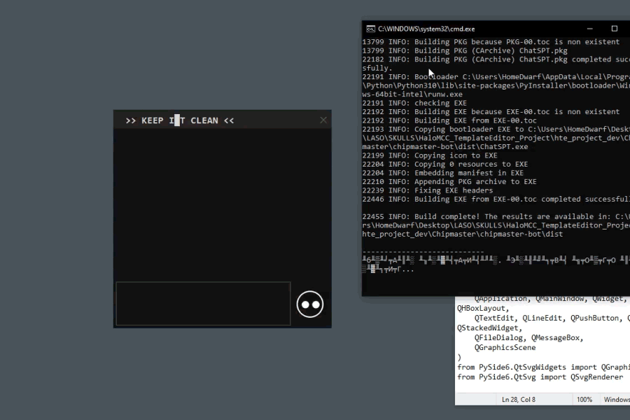

# Chat___

[Download](https://github.com/AleksandrovskyV/chat/releases/latest/ChatSPT.exe)

# shortcuts/
[ ALT + F1 ] or [ ALT + Tilde ]  

# format_cmds/
[help] - help? 
[shortcuts] - all shortcuts  

# roadmap/

### design:
[y] Parametric Header Text                 > ibracks8_pattern.py 
[y] Add IconTarget (constructed on SVG)    > EyeTargetWidget 
[y] Switch bots between selected App       > FocusWatchers... 
[x] Add extend code formating in Chat... 
[x] Add fast mode for LabelSwitchLanguage 

### func:
[y] Add Clear\Recover Messages                  > 
[y] Load JSON from shortcut (telegram json)     > automaticaly update ? 
[x] Add Save History                            > +  / bad logic 

### bots:
* Add hello and stack messages (stack - diffirents bots dialogs)
* Add rules

# package/ 
pyinstaller chipmaster_bot.spec --clean
 [or] package_bot+upd.bat
